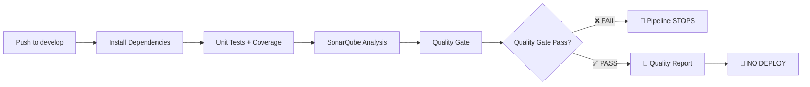
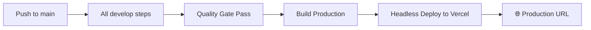

# 📋 GUÍA DE EVALUACIÓN DEVOPS - POKEDX PWA
*Implementación completa del ciclo de vida de desarrollo de software (SDLC)*

## 🎯 OBJETIVO DE EVALUACIÓN
Demostrar un pipeline CI/CD completo, seguro y automatizado para una Progressive Web App (PWA) con gestión de ramas, análisis de calidad y despliegue headless.

## 📊 ARQUITECTURA DEL PIPELINE

### 🌿 RAMA DEVELOP (Desarrollo y Quality Assurance)


### 🌟 RAMA MAIN (Producción)


## ⚙️ CONFIGURACIÓN TÉCNICA

### 🔧 Quality Gate Estricto (SonarQube)
- **Bugs:** > 0 → ❌ FALLA
- **Vulnerabilidades:** > 0 → ❌ FALLA  
- **Cobertura:** < 50% → ❌ FALLA
- **Code Smells:** > 5 → ❌ FALLA
- **Líneas Duplicadas:** > 3% → ❌ FALLA

### 🚀 Despliegue Headless (Vercel CLI)
```bash
# NO conectar GitHub/GitLab via interfaz web
# NO usar disparadores automáticos  
# SÍ usar Jenkins + Vercel CLI

vercel deploy --prod --token=${VERCEL_TOKEN} --yes --force
```

## 🧪 DEMOSTRACIÓN EN VIVO

### **Paso 1: Prueba de Calidad (Fallo Intencional)**
```bash
# En rama develop
git checkout develop

# Editar archivo de demo
nano src/test/demo-failure.test.tsx
# Descomentar tests que fallan intencionalmente

git add .
git commit -m "❌ Introduce fallo intencional para demo"
git push origin develop
```
**✅ Resultado Esperado:** Pipeline en Jenkins se inicia, ejecuta análisis y se detiene en ROJO en "Quality Gate". No avanza.

### **Paso 2: Prueba de Aislamiento (Éxito en Develop)**
```bash
# Corregir el error
nano src/test/demo-failure.test.tsx
# Comentar nuevamente los tests que fallan

git add .
git commit -m "✅ Corrige errores para demo"
git push origin develop
```
**✅ Resultado Esperado:** Pipeline pasa todas las fases en VERDE, pero "Deploy" aparece como SKIPPED (Saltada).

### **Paso 3: Despliegue a Producción (Main)**
```bash
# Crear PR y merge a main
git checkout main
git merge develop
git push origin main
```
**✅ Resultado Esperado:**
- Jenkins detecta cambio en main
- Ejecuta Tests y SonarQube (Pasan)
- Ejecuta script de despliegue via CLI
- Genera URL de producción nueva

### **Paso 4: Auditoría Final de la PWA**
1. **📱 Instalación PWA:** "Add to Home Screen" funcional
2. **🔔 Notificaciones:** Seleccionar Pokemon genera notificación push
3. **📱 Modo Offline:** Desconectar internet, recargar página → Service Worker funciona
4. **🌐 URL Producción:** Verificar acceso desde dispositivos móviles

## 🔧 CONFIGURACIÓN DE JENKINS

### Credenciales Requeridas
```groovy
withCredentials([
    string(credentialsId: 'vercel-token', variable: 'VERCEL_TOKEN'),
    string(credentialsId: 'vercel-org-id', variable: 'VERCEL_ORG_ID'),
    string(credentialsId: 'vercel-project-id', variable: 'VERCEL_PROJECT_ID'),
    string(credentialsId: 'sonarqube-token', variable: 'SONAR_TOKEN')
])
```

### Obtener IDs de Vercel
```bash
# Después de configurar proyecto en Vercel
cat .vercel/project.json
# {
#   "orgId": "tu-org-id",
#   "projectId": "tu-project-id"  
# }
```

## 📂 ESTRUCTURA DE ARCHIVOS CLAVE

```
pokedexpwa/
├── 📄 Jenkinsfile                    # Pipeline declarativo
├── 📄 sonar-project.properties       # Configuración SonarQube
├── 📄 vercel.json                    # Configuración deployment
├── 📄 docker-compose.yml             # Stack completo (Jenkins + SonarQube)
├── 🧪 src/test/
│   ├── demo-failure.test.tsx         # Tests para fallo intencional
│   ├── PokemonList.test.tsx          # Tests de componentes
│   └── PokemonModal.test.tsx         # Tests de modal
├── 📋 quality-gate-config.txt        # Configuración Quality Gate
└── 📚 docs/
    └── EVALUATION-GUIDE.md           # Esta guía
```

## 🏆 CRITERIOS DE APROBACIÓN

### ✅ Funcionalidad PWA
- [x] Service Worker registrado y funcional
- [x] Manifest.json configurado correctamente
- [x] Modo offline operativo
- [x] Notificaciones push implementadas
- [x] Instalación "Add to Home Screen"

### ✅ Pipeline CI/CD  
- [x] Pipeline declarativo en Jenkinsfile
- [x] Gestión de ramas (develop vs main)
- [x] Quality Gate estricto configurado
- [x] Despliegue headless sin auto-push
- [x] Manejo seguro de credenciales

### ✅ Análisis de Calidad
- [x] Tests unitarios con cobertura
- [x] Integración SonarQube completa
- [x] Quality Gate detiene pipeline en develop
- [x] Reportes de cobertura y métricas

### ✅ Despliegue Seguro
- [x] CLI deployment sin interfaz web
- [x] Tokens como credenciales secretas
- [x] Project linking no interactivo
- [x] URL producción generada automáticamente

## 🚨 PUNTOS CRÍTICOS

⚠️ **SIN Auto-Push:** Vercel NO debe conectarse automáticamente a Git
⚠️ **CLI Obligatorio:** Deploy debe ejecutarse desde Jenkins via Vercel CLI
⚠️ **Quality Gate:** Debe FALLAR con bugs > 0 o vulnerabilidades > 0
⚠️ **Branches:** Develop NO despliega, solo main despliega

## 📞 SOPORTE TÉCNICO

Si encuentras problemas durante la evaluación:

1. **Jenkins no inicia:** `docker-compose up -d jenkins`
2. **SonarQube no responde:** `docker-compose restart sonarqube`  
3. **Quality Gate no falla:** Verificar configuración en SonarQube UI
4. **Vercel deploy error:** Verificar tokens y project.json

---

**🎯 ¡El entorno está listo para la evaluación DevOps completa!**